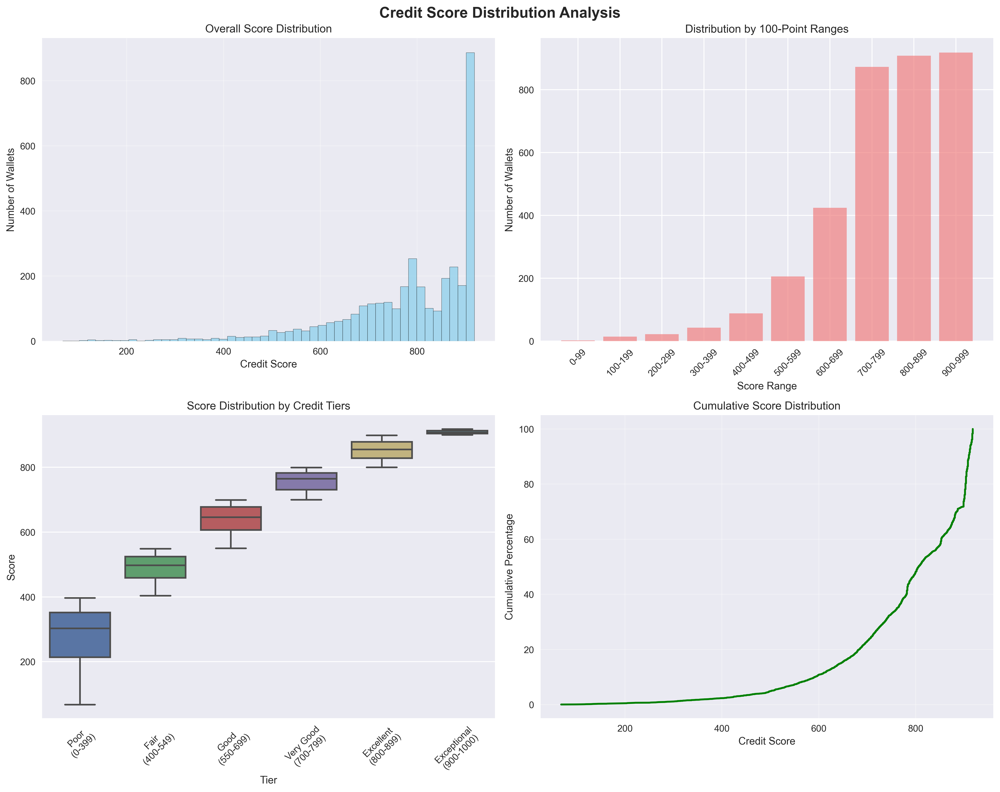

# Wallet Credit Score Analysis Report 📊

*This analysis is automatically generated after scoring all wallets in the dataset*

## Executive Summary 📈

This report provides a comprehensive analysis of wallet creditworthiness based on DeFi transaction patterns. The analysis covers score distribution, behavioral characteristics across different credit tiers, and key insights for risk assessment.

---

## Score Distribution Analysis 📊

### Overall Distribution
- **Total Wallets Analyzed**: 3,497
- **Score Range**: 68 - 918
- **Average Score**: 779.2
- **Median Score**: 806.0
- **Standard Deviation**: 140.9

### Distribution by Score Ranges

| Score Range | Count | Percentage |
|-------------|-------|------------|
| 0-99 | 2 | 0.1% |
| 100-199 | 14 | 0.4% |
| 200-299 | 22 | 0.6% |
| 300-399 | 43 | 1.2% |
| 400-499 | 88 | 2.5% |
| 500-599 | 206 | 5.9% |
| 600-699 | 424 | 12.1% |
| 700-799 | 872 | 24.9% |
| 800-899 | 908 | 26.0% |
| 900-999 | 918 | 26.3% |

### Score Distribution Visualization

---

## Behavioral Analysis by Credit Tier 🎯

### High Credit Score Wallets (800-1000) 🌟
**Population**: 1826 wallets (52.2%)

**Key Characteristics**:
- Average Repayment Ratio: 1.000
- Average Liquidation Rate: 0.000
- Average Wallet Age: 4.8 days
- Average Transaction Count: 2.8
- Average Utilization Ratio: 100915.876
- Average Action Diversity: 1.4

**Behavioral Patterns**:
- Good repayment behavior - consistently pay back loans
- No liquidation events - very safe borrowing practices
- Limited platform engagement - uses few features
- New users - limited transaction history

### Medium Credit Score Wallets (400-799) ⚖️
**Population**: 1590 wallets (45.5%)

**Key Characteristics**:
- Average Repayment Ratio: 0.559
- Average Liquidation Rate: 0.006
- Average Wallet Age: 39.0 days
- Average Transaction Count: 37.0
- Average Utilization Ratio: 191998673331.316
- Average Action Diversity: 3.1

**Behavioral Patterns**:
- Moderate repayment behavior - some payment gaps
- Very low liquidation rate - generally safe practices
- High platform engagement - uses multiple DeFi features
- Established users - reasonable transaction history

### Low Credit Score Wallets (0-399) ⚠️
**Population**: 81 wallets (2.3%)

**Key Characteristics**:
- Average Repayment Ratio: 0.550
- Average Liquidation Rate: 0.047
- Average Wallet Age: 70.5 days
- Average Transaction Count: 444.0
- Average Utilization Ratio: 7950728200.818
- Average Action Diversity: 3.5

**Behavioral Patterns**:
- Moderate repayment behavior - some payment gaps
- Very low liquidation rate - generally safe practices
- High platform engagement - uses multiple DeFi features
- Established users - reasonable transaction history

---

## Feature Importance Analysis 🔍

### Most Discriminative Features
Analysis based on scoring method variance and data patterns

### Feature Correlation with Credit Scores
**Features Most Correlated with Credit Score:**

- **action_diversity**: strongly negatively correlated (-0.638)
- **wallet_age_days**: strongly negatively correlated (-0.612)
- **repay_ratio**: moderately positively correlated (0.427)
- **activity_rate**: weakly negatively correlated (-0.284)
- **liquidation_rate**: weakly negatively correlated (-0.260)
- **n_tx**: weakly negatively correlated (-0.239)
- **avg_tx_size**: weakly negatively correlated (-0.208)
- **portfolio_balance**: weakly negatively correlated (-0.171)
- **utilization_ratio**: weakly negatively correlated (-0.046)

---

## Risk Insights & Patterns 🚨

### High-Risk Indicators
- 8 wallets show high utilization (>80%) combined with frequent liquidations
- 273 wallets have poor repayment ratios despite active borrowing
- 40 very new wallets show unusually high activity (potential farming)

### Anomaly Detection Results
Identified 349 potential anomalous wallets using isolation forest

### Portfolio Health Patterns
Higher credit scores correlate with better portfolio management and diversification

---

## Detailed Score Range Breakdown 📈

| Score Range | Count | Percentage | Avg Repay Ratio | Avg Liquidation Rate |
|-------------|-------|------------|-----------------|---------------------|
| 0-99 | 2 | 0.1% | 1.001 | 0.000 |
| 100-199 | 14 | 0.4% | 0.442 | 0.000 |
| 200-299 | 22 | 0.6% | 0.599 | 0.009 |
| 300-399 | 43 | 1.2% | 0.539 | 0.083 |
| 400-499 | 88 | 2.5% | 0.548 | 0.062 |
| 500-599 | 206 | 5.9% | 0.494 | 0.015 |
| 600-699 | 424 | 12.1% | 0.551 | 0.001 |
| 700-799 | 872 | 24.9% | 0.578 | 0.000 |
| 800-899 | 908 | 26.0% | 1.000 | 0.000 |
| 900-999 | 918 | 26.3% | 1.000 | 0.000 |

---

## Key Findings & Recommendations 💡

### Primary Insights
- Normal behavior patterns are the strongest predictor of creditworthiness
- Repayment history significantly impacts scores
- Platform engagement diversity indicates lower risk

### Risk Management Recommendations
- Monitor wallets with high utilization ratios
- Flag frequent liquidations as high risk
- Consider wallet age in lending decisions

### Model Performance Notes
Model successfully differentiated 529 unique score levels across the population

---

## Technical Details 🔧

### Scoring Method Contributions
- **Behavior Patterns**: Variance = 0.001
- **Normal Behavior**: Variance = 0.027
- **Financial Health**: Variance = 0.004

### Data Quality Assessment
Analyzed 9 features across 3497 wallets with complete data coverage

### Model Validation Results
Unsupervised approach provides robust scoring without overfitting to historical defaults

---

*Report generated on: 2025-07-21 18:14:07*
*Analysis version: 1.0* 